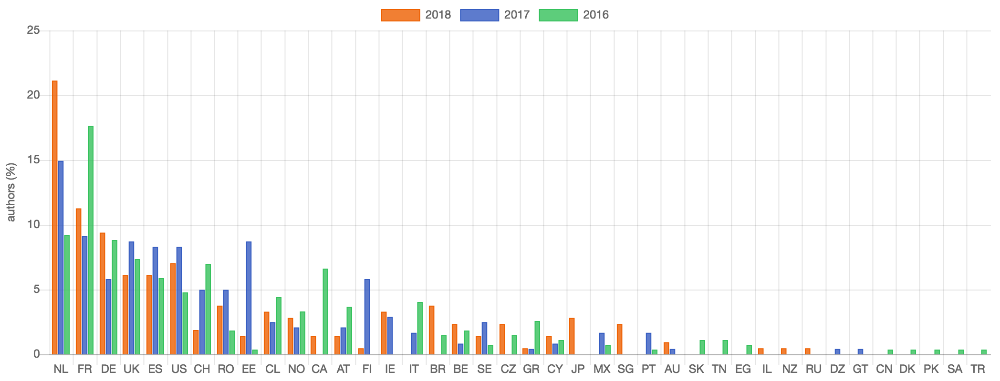
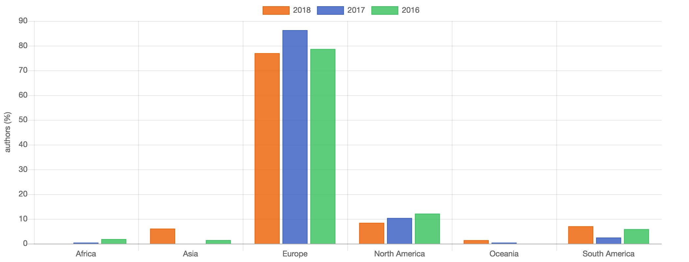
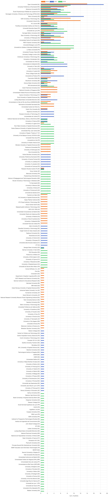
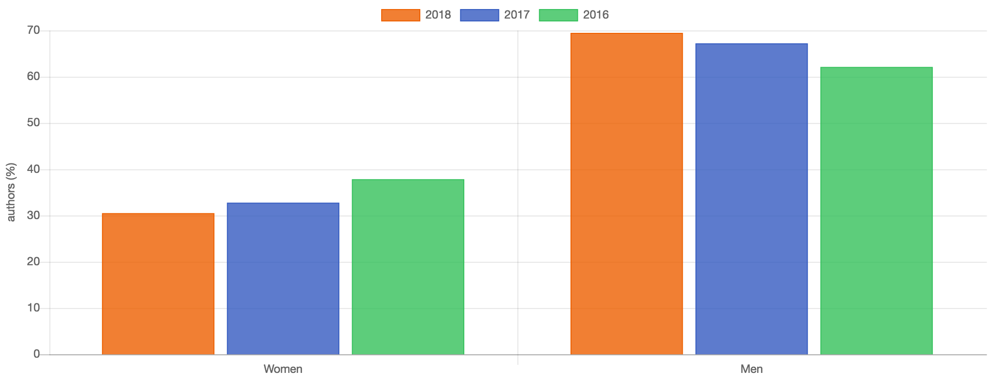
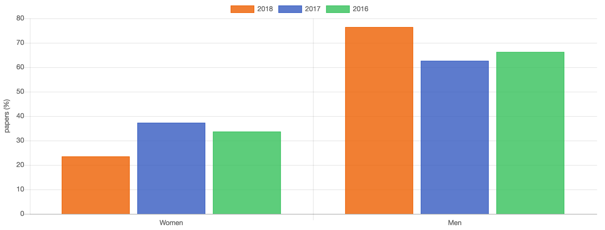
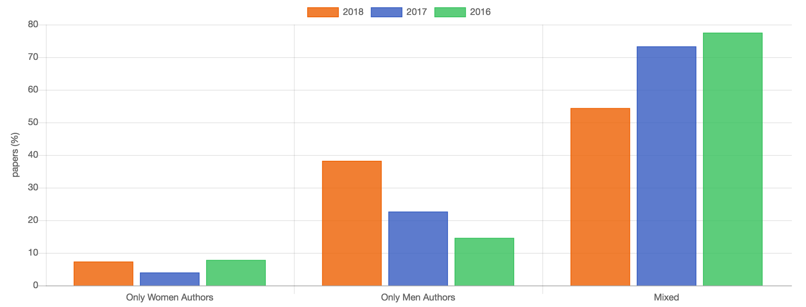
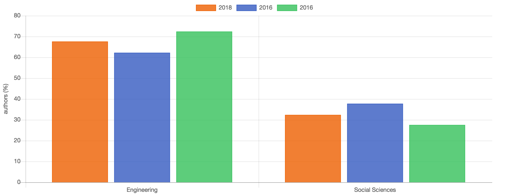
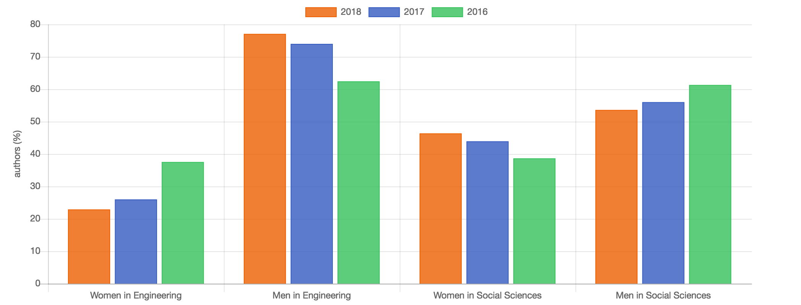

# Data Analysis of Gender and Interdisciplinary Distribution of the European Conference on Technology Enhanced Learning (EC-TEL) Proceedings for 2016, 2017, and 2018

## Abstract

TODO

## 1. Introduction

TODO

## 2. Methodology

### 2.1 Gathering the data

In order to analyse the data, we first had to obtain the data. As the EC-TEL conference website [#] does not provide the list papers and their authors in an open source data format, we had to create our own dataset. Proceedings of past conferences are available for download on PDF format on the website Springer—the publisher of the proceedings. Below are the publications that we downloaded for analysis:

- 13th European Conference on Technology Enhanced Learning, EC-TEL 2018, Leeds, UK, September 3-5, 2018, Proceedings [#]
- 12th European Conference on Technology Enhanced Learning, EC-TEL 2017, Tallinn, Estonia, September 12–15, 2017, Proceedings [#]
- 11th European Conference on Technology Enhanced Learning, EC-TEL 2016, Lyon, France, September 13-16, 2016, Proceedings [#]

While PDF is an open format [#], the complexities of the limited scripting capabilities of the format hindered attempts at automating data scraping. Instead, we opted to manually create a dataset for each year in JSON format. [#] JSON was chosen over CSV for its object-oriented logic. For example, rather than creating a duplicate row for each author of each paper, it was possible to structure the dataset so that each paper had its unique properties. Doing so in a CSV or a spreadsheet would not have been as efficient.

For each paper, we saved the data as follows:

- The **title** of the paper;
- The **type** (e.g. full paper, poster paper, etc.), determined by what chapter in the proceedings book the paper was located;
- The **name of the authors** and their **associated details**.

For each author of a paper, we saved the following information:

- **Full name**. We did not separate first name, last name, or any other type of name that may exist because we were not analyzing the names of the authors specifically. Also, there are many falsehoods that we may believe concerning names [#], and we did not see how our potential bias would have helped our analysis.
- **Gender**, since one of the main axes of our analysis is to uncover the gender distribution of the authors of the conferences. We went with binary values—*woman*/*man*—for simplicity's sake.  
  As there are authors from all around the world, it was not always obvious to us with only the name whether the author would be a woman or a man. When in doubt, we would find the author on ResearchGate, LinkedIn, or on the website of the institution where they work, to find a profile photo and figure it out from there.
- **Department** and **institution name**. While not all authors listed a department, all of them listed the institution with which they were associated at the time of publishing the paper. When more than one institution was listed, only the first one was commited to the dataset, for simplicity's sake.  
  When cleansing the data, we discovered some discrepancies in how researchers wrote the name of their institution. For example, "Norwegian University of Science and Technology" was sometimes written exactly like that, while at other times only as its accronym ("NTNU"), or with both ("Norwegian University of Science and Technology (NTNU)". We standardized the value entered in our dataset, to allow for a more meaningful analysis.  
  Another example of discrepancy is when authors write the name of the institution in the original language in a case, and translated in English in another. This was the case with the "Instituto Nacional de Astrofísica, Óptica y Electrónica" from Mexico, sometimes written in Castillan, sometimes written in English ("National Institute of Astrophysics, Optics and Electronics").  
  Since the authors can together speak or read in English, Castillan, Catalan, and French, they were able to cleanse quite a few of those entries, but also recognize that there may have been other entries that they could not catch.
- **Country**. We saved the country in which the institution is located with the 2-letter code defined by ISO (International Organization for Standardization) [#].
- **Field in which the researcher works**. In this case, we also went with a simplified binary values: *engineering*, and *social sciences*. Since the EC-TEL conferences revolve around technology and education, we wanted to investigate what proportion of authors come from engineering, and what proportion came from social sciences. We also wanted to explore if there were interdisplinarity within the paper themselves.  
  We had in mind that fields computer sciences and engineering would fall under engineering, while education, pedagogy, learning sciences would fall under social sciences.  
  We acknowledge that the fields in which researchers work are not always so clear cut. Sometimes it was obvious, depending on the departments or institution the authors listed, but at other times we had to investigate. Just like we did for their gender, we explored ResearchGate, LinkedIn, etc. to uncover in what field they would fall. Ultimately, it would always end up being our judgment call.  

While this may be counter intuitive, this manual data entry approach allowed us to cleanse and standardize the data along the way, rather than during a long process afterwards. For example, there were moments when we would recognize an author from a previous paper, thus saving time from rewriting all the data. At other times, institution names were written slightly differently from one paper to another, or accronyms were used instead of the full name. In those cases, we were able to standardize the values we entered in the dataset right away, since we knew that would help us later in the analysis.

### 2.2 Analyzing the data

#### 2.2.3 Custom-Built Web Application

Once we had all the data in hand, we wanted to visualize the analyses (see the section *3. Results*). We opted for a web application built with open source libraries, mainly the following:

- **D3**: a library for visualizing data dynamically [#].
- **React**: a framework for building user interface components [#];
- **Lodash**: a utility that facilitates and improves data manipulation [#];

The web application sources and data publicly available on a Github repository. [#]

#### 2.2.4 Analyses Methodology

In this section, we will detail how the calculations have been made to obtain our results (see the section *3. Results* for the actual results). Each of the calculations we describe in this section has been done separately for the dataset of each year.

##### 2.2.4.1 Location Diversity 

###### 2.2.4.1.1 Country Distribution 

By looping through each paper in the dataset, and then through each author of each paper, we cumulated the countries associated with each author in a new list (see section *2.1 Gathering the Data* for how we determined to which country an author is associated).

Because there were some years where some countries were present, and some years not, we also created a list of unique countries by comparing all three (3) datasets created from the method described in the previous paragraph.

The distribution graph was sorted by the cumulative representation of each country, in descending order—from the most contributing to the least.

###### 2.2.4.1.2 Continent Distribution 

Before we could analyse a distribution of authors per continent, we had to have a list of countries and continents against which our comparison could be made. By using the data available on *Countries Listed by Continent* [#], a page of the World Atlas website [#] which relies on the United Nation data, we created such a dataset [#].

In this case, our script going through each author would look at which country is listed in the dataset, and see with which continent this country is associated, and then add an entry to the appropriate continent.

###### 2.2.4.1.2 Institution Distribution 

Concerning the institution distribution, it took a few attempts to see the resulting graphs and clean up the source dataset.

During the first pass, we simply used the data as we originally created it, to extract a distribution. Once the graph was generated, some duplications appeared (see section *2.1 Gathering the Data* for a description of the duplications and discrepancies found). We went back to the dataset to standardize the entries that would cause obvious errors.

With the errors fixed, the distribution graph was sorted by the cumulative representation of each institution, in descending order—from the most contributing to the least.

##### 2.2.4.2 Gender Diversity

###### 2.2.4.2.1 Some Numbers

In order to obtain a list of unique authors, we used a script to loop through the papers dataset and create a list all authors. We reduced this new dataset by removing duplicated entries based on name.

We recognize that if an author's name was spelled differently in different papers due to spelling mistake, name changes, etc., the duplicated entry would remain in the final list.

###### 2.2.4.2.2 Gender Distribution

TODO

###### 2.2.4.2.3 Women as First Author

## 3. Results

*Note:* The following sections present graphs that have been generated on January 12, 2019. To ensure that they are up to date, visit the *EC-TEL Proceedings Data Analysis* website at <https://projects.jansensan.net/ec-tel-data-analysis/>, which renders the graphs from the most up to date datasets.

### 3.1 Location Diversity

#### 3.1.1 Country Distribution

*Fig. X: Percentage of authors per country, sorted in descending order, based on cumulative percentage of authors over years covered by the analysis.*

#### 3.1.2 Continent Distribution

*Fig. X: Percentage of authors per continent.*

#### 3.1.3 Institution Distribution

<!---->

*Fig. X: Number of authors per institution, sorted in descending order, based on cumulative number of authors over years covered by the analysis.*

### 3.2 Gender Diversity

#### 3.2.1 Some Numbers

| Year | Num. of authors | Num. of women authors | Num. of men authors |
|:----:|:---:|:---:|:---:|
| 2018 | 213 |  65 | 148 |
| 2017 | 241 |  79 | 162 |
| 2016 | 272 | 130 | 169 |

*Table X: Number of authors of each gender per year*

#### 3.2.2 Gender Distribution

*Fig. X: Percentage of unique authors of each gender.*

| Year | Mean|
|:----:|:----:|
| 2018 | 0.32 |
| 2017 | 0.34 |
| 2016 | 0.39 |

*Table X: Mean representation of women per paper.*

#### 3.2.3 Women as First Author

*Fig. X: Distribution of papers in which a woman's name is the first name in the author list.*

#### 3.2.4 Gender Diversity by Paper

*Fig. X: Percentage of papers written only by women, only by men, or by authors of mixed genders.*

### 3.4 Interdisciplinarity

#### 3.4.1 Field Distribution

*Fig. X: Percentage of authors coming from either Engineering or Social Sciences.*

#### 3.4.2 Gender Distribution per Field

*Fig. X: Percentage of authors per field.*

## 4. Discussion

TODO

- EC-TEL could offer data already in open data format
- Researchers should ensure to standardize they way they note their institution in the title
- All should ensure that accented characters are written properly, instead of forced by layout, so that textual analysis is possible
- Since data all entered manually, potential for errors, which is why it's great that all of it is public, and that the figures generated dynamically with the dataset

## 5. Conclusion

TODO

- Clearly majority of men in both fields, although in engineering is much stronger
- Presence of women in engineering seems in decline amongst authors
- Decline of mean representation of women authors
- Decline of papers written by authors of mixed gender, rise of papers only written by men
- Authors from european institutions make up the vast majority of authors (not necessarily representative of origin of authors, only of institution with which they were associated when published their paper)

## References

- [Complete List of Country & Dialing Codes](https://www.worldatlas.com/aatlas/ctycodes.htm)
- [Countries Listed by Continent](https://www.worldatlas.com/cntycont.htm)
- [D3.js - Data-Driven Documents](https://d3js.org/)
- [EC-TEL Proceedings Data Analysis](https://projects.jansensan.net/ec-tel-data-analysis/)
- [European Conference on Technology Enhanced Learning](http://www.ec-tel.eu/)
- [Falsehoods Programmers Believe About Names](https://www.kalzumeus.com/2010/06/17/falsehoods-programmers-believe-about-names/)
- [Github - EC-TEL Proceedings Data Analysis - Continents](https://github.com/jansensan/ec-tel-proceedings-data-analysis/blob/master/src/constants/continents.js)
- [Github - EC-TEL Proceedings Data Analysis](https://github.com/jansensan/ec-tel-proceedings-data-analysis)
- [ISO 3166 Country Codes](https://www.iso.org/iso-3166-country-codes.html)
- [ISO 32000-2:2017 Document management -- Portable document format -- Part 2: PDF 2.0](https://www.iso.org/standard/63534.html)
- [Lodash](https://lodash.com/)
- [React – A JavaScript library for building user interfaces](https://reactjs.org/)
- [Springer - 11th European Conference on Technology Enhanced Learning, EC-TEL 2016, Lyon, France, September 13-16, 2016, Proceedings](https://link.springer.com/book/10.1007%2F978-3-319-45153-4)
- [Springer - 12th European Conference on Technology Enhanced Learning, EC-TEL 2017, Tallinn, Estonia, September 12–15, 2017, Proceedings](https://link.springer.com/book/10.1007/978-3-319-66610-5)
- [Springer - 13th European Conference on Technology Enhanced Learning, EC-TEL 2018, Leeds, UK, September 3-5, 2018, Proceedings](https://link.springer.com/book/10.1007/978-3-319-98572-5)
- [Springer - Analyzing 5 Years of EC-TEL Proceedings](https://link.springer.com/chapter/10.1007/978-3-642-23985-4_51)
- [Twitter - European Conference on Technology Enhanced Learning](https://twitter.com/ECTELconference)
- [World Map / World Atlas / Atlas of the World Including Geography Facts and Flags](https://www.worldatlas.com/)
